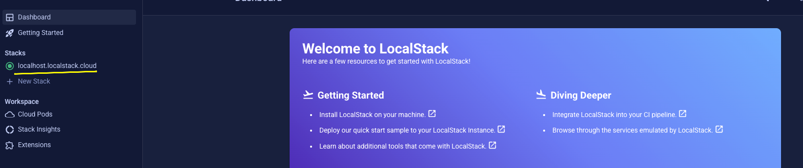

# data-engineer-challenge

## Descrição

Estamos construindo uma plataforma de dados chamada Datahub. Nessa plataforma os dados são organizados em tabelas no storage do s3.

Conforme as tabelas são atualizadas é necessário atualizar o catálogo do glue adicionando essas novas partições para que os usuários consigam consumir os novos dados.

Precisamos construir serviços que resolva os seguintes problemas:

- ingestão dos dados
- armazenamento em tabelas no s3
- catalogação das tabelas no catálogo de metadados
- os dados precisam ser armazenados de forma a otimizar o consumo analítico

## Requisitos Funcionais

- A cada nova partição criada no storage do s3 para uma tabela deve ser adicionado essa nova partição no catálogo de metadados
- Deve ser ignorado partições repetidas
- Deve existir um controle de estado para auxiliar no processamento (adicionar as novas partições, evitar tentar adicionar partições já adicionadas)

## Requisitos Não Funcionais

- A solução deve ser genérica para atender qualquer tabela da plataforma
- Precisamos avaliar seu nível de conhecimento nos serviços da aws, principalmente com s3, sns, sqs, lambda, dynamodb, glue, iam, stream, então quanto mais utilizar melhor.
- Precisamos avaliar seus conhecimentos em programação (java) e arquitetura, então demonstre o máximo que conseguir (seja na modelagem do que será desenvolvido até a codificação).
- É preciso utilizar a versão free do LocalStack para emular os serviços da aws
- Sugerimos que inicie o LocalStack na sua máquina utilizando o docker-compose fornecido na documentação da ferramenta ([ver instruções a seguir](#ligando-o-local-stack)). Em seguida, você pode utilizar LocalStack Desktop ou a versão web (https://app.localstack.cloud) para visualizar seus recursos.
- Desejável construir os recursos utilizando terraform (você pode utilizar tflocal conforme descrito na documentação do LocalStack)
- Você pode utilizar hive metastore utilizando docker-compose para emular o glue e nada impede que seja utilizado a criatividade para emular de outra forma
- Será preciso nos apresentar a solução rodando e nos explicar suas decisões
- Você pode utilizar AI no desenvolvimento e gostaríamos que nos explicasse como utilizou
- Sinta-se livre para demonstrar sua criatividade e utilizar outros recursos pertinentes que julgar necessário ou que possa melhorar a solução
- Sinta-se à vontade para enviar o que fizer mesmo se não conseguir finalizar tudo que gostaria de fazer

# Ligando o Local stack

1. Cria diretório de volume e concede permissão necessária:

```shell
cd docker
mkdir volume
chmod 777 volume
```

2. Inicia o docker compose do LocalStack:

```shell
docker compose up
```

3. Acesse https://app.localstack.cloud/ e faça login da forma que preferir, deve aparecer algo como:



4. Teste a conexão com o serviço executando:

```shell
export AWS_ACCESS_KEY_ID="test"
export AWS_SECRET_ACCESS_KEY="test"
export AWS_DEFAULT_REGION="us-east-1"
aws s3 ls --endpoint-url=http://localhost:4566
```

5. Utilize o parâmetro "--endpoint-url=http://localhost:4566" nos comandos do aws cli e o parâmetro endpointOverride do sdk da aws "https://localhost.localstack.cloud:4566"

```java
import software.amazon.awssdk.auth.credentials.AwsBasicCredentials;
import software.amazon.awssdk.auth.credentials.StaticCredentialsProvider;
import software.amazon.awssdk.regions.Region;
import software.amazon.awssdk.services.s3.S3Client;

public class Main {
    public static void main(String[] args) {
        final String ACCESS_KEY = "test";
        final String SECRET_KEY = "test";
        Region region = Region.US_EAST_1;

        S3Client s3Client = S3Client.builder()
                .endpointOverride(URI.create("https://s3.localhost.localstack.cloud:4566"))
                .credentialsProvider(StaticCredentialsProvider.create(
                        AwsBasicCredentials.create(ACCESS_KEY, SECRET_KEY)))
                .region(region)
                .build();

        var list = s3Client.listBuckets();
    }
}
```

Veja mais em: https://docs.localstack.cloud/user-guide/integrations/sdks/java/

6. Instale o terraform caso ainda não tenha instalado

https://developer.hashicorp.com/terraform/install

7. Instale o tflocal em um ambiente virtual do python

```shell
python3 -m venv .venv
chmod 777 ./.venv/bin/activate
source ./.venv/bin/activate
pip3 install terraform-local
```

Veja mais em: https://hashnode.localstack.cloud/testing-s3-notifications-locally-with-localstack-terraform

8. Inicie o terraform local

Nota: todos os comandos do tflocal precisam ser executados com o ambiente virtual python ativado. Ver passo anterior.

```shell
mkdir terraform
cd terraform
tflocal init
```

9. Para ver os comandos disponíveis do tflocal utilize:

```shell
tflocal
```

10. Chegando até aqui, você está com tudo que precisa rodando para iniciar seu teste. Boa sorte!!

